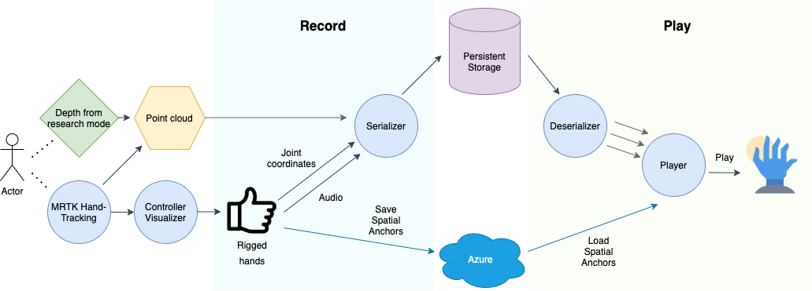

# Holographic Recording

## Introduction
In the past decade, with the increasing availability of video media on YouTube and other content sharing platforms, people have become increasingly reliant on videos to learn how to perform physical tasks that are as simple as using appliances and as complex as fixing machinery.  However, as helpful as 2D video instructions can be, they still have limitations because 2D videos are restricted to a single perspective. This means important motion and tasks can often be occluded from the camera view. It can also be difficult for users to translate instructions performed on a 2D screen into their 3D world.

As a solution for such problems, we want to use mixed reality holograms to display instructions in 3D, as they provide a rich and immersive experience. To create an immersive tutorial on how to use a physical object, a user could wear the Microsoft HoloLens to record themselves performing a task. In order to watch the tutorial, other users could play the recording when they are standing next to the physical object and view the recorder's holographic hands and actions from different angles, thus enabling them to better understand the instructions.

The goal of this project is to create a mixed reality application that enables a user to record their hands performing multiple physical tasks, and allows other users to replay that recording as a hologram so that they can replicate the actions and tasks performed.

## Methodology

To achieve the goal of visualizing instructions in an intuitive manner, we decided to both visualize the hands that are performing the task and the object held by the hands if any. For example, the recorded video of using a coffee machine would show a set of holographic hands pressing buttons and the cup held by the hands. For the cleanest implementation and visually pleasing holographic hands, we chose to utilize the hand-tracking API offered by MixedRealityToolkit (MRTK) on Unity. This option allows us to present a very well polished mesh representation of the recorded hands. However, while MRTK supports hand-tracking, it does not provide a way to obtain some representation of the object held. In order to extract information directly from raw data, we also utilize the research mode API of the Hololens. The research mode API allows us to record AHAT high-frequency near-depth sensing data from which we can segment out 3D point clouds of the hands and objects held.

To summarize, we had two approaches: 
Getting the hand joint data using MRTK hand-tracking API
Getting the point cloud data from AHAT data using the research mode API.

The goal of the first approach was to create a replayable hand animation on a premade rigged hand model. This method achieves the cleanest representation of the recorded hands and thus provides the best user experience for learning instructions. In contrast, the goal of the second two was to create a point cloud animation that could also represent objects held in hand so that the application supports a wider variety of tasks, including tasks that require handheld tools.

### Features

* Record and playback hand animation as a smooth mesh.
* Persist data and location across sessions.
* Record and playback point cloud animation of hands and objects held by hands.
* User interface that displays a screenshot representation of the recording.
* User interface for recording, playback, and deletion of recording.
* Audio recording and playback

## Architecture

The features and components of our application can be largely grouped into two groups; those for recording and those for playback. Both approaches in our implementation require extraction of necessary data, serialization, storing, deserialization, data parsing, and finally playback. Fig.1 shows a diagram of the architecture of our application. We extract point cloud data using the depth data recorded through the research mode API and in parallel extract hand joint position and rotation using the MRTK hand-tracking API. In addition, we also record the audio data to allow voice instructions. Once the data is formatted, they are serialized and stored into persistent storage. In order to playback recordings in the same location across different sessions, the spatial anchors are uploaded to Azure. During playback, all data (hand joint coordinates, audio, and point cloud) is deserialized and played according to the spatial anchors downloaded from Azure. 

## Hand Animation Creation
To create a hand animation we applied animation to a rigged hand model using Unity’s animation features. A rigged model allows us to create animations by providing AnimationCurves, a collection of keyframes evaluated over time, for each rigged joint.  We decided to take MRTK’s rigged hand and apply a specific mesh material that improves user experience. To create an animation that moves the hand according to the data recorded through hand-tracking, each joint of the rigged hand needs to be provided its local coordinates - the coordinates with respect to its parent. Since we wanted to keep the architecture as efficient and simple as possible, we made the mapping between the world coordinates and the local joints coordinates trivial by utilizing the real-time visualizer of MRTK called RiggedHandVisualizer which already implements the mapping from MRTK joints to the joints of the rigged hands. This means we activated the controller visualizer, a feature that allows visualization of some provided prefab according to the tracked hands, in the MRTK profiles, and then the rigged hand visualizer would instantiate a rigged hand in the scene whenever MRTK detected a hand.

We record the data to be persisted by saving snapshots of the position and rotation of each joint of the instantiated rigged hand at every 10th frame. We then used these stored coordinates to create animation curves for our final animation clip. AnimationCurves tell a joint how it has to move relative to its parent. The position and rotation are interpolated between the keyframes for smooth animation. While this implementation allows us to store and playback 3D holographic hands in the correct sequence of movements, when the hand could not be tracked, the interpolation between keyframes causes the hand animation to fly off or cripple when the keyframes are far apart. The solution we implemented for this problem was to keep track of the intervals at which the hands are not tracked and then set the material of the hands invisible at those intervals. We also considered only setting the hand invisible only if the period of time at which the hands are not tracked is longer than a given threshold, but since the interpolation fails quickly for the best experience we set the hands invisible immediately. 

Audio is recorded using the native Unity Microphone API. This API requires the input of audio length at the start of recording. Since we do not know the length of the clip prior to stopping the recording, the audio clip is recorded at an arbitrarily long length then transferred to a shorter clip based on the duration of the recording after the recording has been stopped. The transfer of audio data is done on a background job to prevent the app from crashing due to performance issues.

## Persisting Data Across Sessions
Our initial implementation stores animation and sound data only as class member variables that are passed directly to the playback component. Without storing the data to persistent storage, users on a different app session or device will not be able to playback the animations recorded.
To persist animation clips across sessions we serialized them to disk so they could be deserialized in a later session. In Unity, there is no native way to persist animation clips at runtime, the in-built features are provided only through the Unity editor. Therefore we decided to just save the keyframes to disk and create the animation clips from these saved keyframes at runtime. For performance reasons we serialized the coordinates into a binary format and did so on background processes that are called Jobs in Unity. This was necessary to prevent the UI from freezing when saving and loading are done on the main UI thread. Audio is serialized as .wav files, we use open source code for serialization into .wav files.

A crucial requirement for playing recordings in the same location and context in different app sessions is to know the change in world origin in the new session. We accomplish this by employing spatial anchors, which are anchors that store the 3D spatial location of objects. Azure spatial anchor offers a pipeline to upload spatial anchors to the cloud and the API to store and load spatial anchors. Once a recording has been generated, the current world origin is stored as an anchor and uploaded to Azure. The anchor-to-recording ID mapping is stored as a binary file on disk. At playback, we use the anchor-to-recording ID mapping to retrieve the anchor ID we wish to download from Azure, and then set the loaded animation as a child object to the spatial anchor so that the animation is played with respect to the original world origin and not the current world origin. This feature allows us to create multiple recordings that can be played again in the same location after the app or device is restarted. The user would be able to look for recordings in a room and play the tutorial of choice, potentially using a different type of device, left by the user who recorded them at a different time. Our implementation is based on the Azure spatial anchor demo app.

## Point Cloud Animation Overview

In order to get the depth information of the surroundings, we leveraged the Research Mode API for Hololens2. We specifically focused on Articulated Hand Tracking (AHaT) depth to get a field of view close to the hands. The Research Mode API is available natively, but we needed to get the data in Unity in order to take advantage of the UI and MRTK features. Hence, we used a C++ wrapper written on top of the Research Mode API. We built this library in ARM64, Release, and included the dll directly in the Unity project as a Plugin. This way we were able to get all the research mode data through Unity directly. Similar to the MRTK hand animation recording, we queried the research mode data at regular intervals and used the camera extrinsic for generating sets of points in world coordinates. These lists of points and corresponding timestamps are then written into local files by background processes.

The AHaT depth calculates only aliased depth which makes all the points lie in depth 0-1m. This causes the actual far off points to wrap back and float around the correct points. This looks noisy and the extra points need to be filtered out before rendering. For cleaning the point clouds we used MRTK hand tracking to get hand joint coordinates. Using the hand coordinates, we only kept the points that are within a certain distance threshold. This approach captures the hand points as well as handheld objects.

## Creating a smooth workflow with intuitive UI
We created user interface elements to best assist users to utilize the features that we have implemented. We used a hand menu, which follows the hand, to access the recording controls such as the start recording and stop recording button. When the stop recording button is pressed, the application instantiates a prefab that represents the recording. This representation has a title and a screenshot that was taken during the recording. It also stays as a marker to indicate the existence of a recording at a location and will be persisted across sessions. Pressing the stop button triggers the keyboard used to give the recording a title. The representation contains the data associated with the recording and can be dragged around. When the application starts up the spatial anchors are loaded from Azure to spawn the representation window at the same location it was recorded. This has to be done on the UI thread therefore the UI freezes shortly. Each representation can be deleted and will no longer be loaded in the next session. Finally, to playback one coherent animation we begin playing the hand animation with the invisibility setter, audio playback, and point cloud animation in parallel. 

## Future Improvements
Although we reached our goals for the project, the application can be further improved and published on the app store. Areas that can be improved include, hand animation, performance, point cloud, persistence across devices and multi-platform support. 

In terms of hand animation improvements, one could look into improving the interpolation between keyframes, because it seems like the curve could interpolate such that the values of the curves between the keyframes are between the values of the keyframes themselves. The hand animation of the rigged hand does not look as polished and smooth as the default hand mesh visualization. This leads us to believe that a hand model with the same joints as the MRTK hand would result in a better visualization. One can see that the rigged hand visualizer does not exactly follow the fingers as closely as the default MRTK hand visualization does. This is because it is very difficult to map one set of joints to the other. Especially around the palm and thumb where you can see animation artefacts, such as protruding spikes, when you move the fingers. Microsoft is currently working to improve the RiggedHandVisualizer and the rigged hand model, which can be integrated in the future to mitigate the hand animation artifacts.

The space for improvement is even greater for the point cloud approach. First of all, we could upsample the point cloud as currently they look sparse. One could further explore dense reconstruction of the point clouds by integrating RGB data from the research mode API. Furthermore, the point cloud still includes unnecessary points that should be removed. We could achieve this with more advanced point cloud segmentation methods or additional post processing clean up. Finally, the current method limits the smoothness of the animation due to a performance bottleneck, one could improve the experience by increasing the frames per second of the point cloud animation.

For the best usability, the app can be further extended to upload all relevant data to a server so that recordings can be persisted across devices. Cross-device persistence can open up opportunities to support multi-platform usage, which means users can view recordings on other types of platforms such as mobile for convenience. With these improvements, the application could be published to the app store for public usage.
